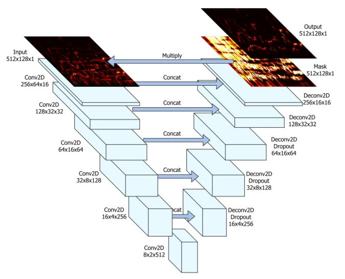

# vocal-style-transfer

## Members

- [Hwang John](https://github.com/HwangJohn)
- [Jeong Seung Woo](https://github.com/Jeongseungwoo)
- [Nam Yoon Sahng](https://github.com/NamSahng)
- [Choi Jiseok](https://github.com/chlwltjrtl)
- Jang Woo Jong
- Lee Yu Jin
- Jang Ji Chang

## Requirement

- librosa==0.6.2
- numpy==1.14.3
- pyworld==0.2.4
- tensorflow==1.9.0
- python==3.6.5

## Usage
### Training Separation Model 
If you have already seperate Song, then skip these step.  
Before training, you need to prepare datasets in "./data".  
we used CCMixter(50 songs : each consists mix, inst, vocal) 
- Train
<pre><code>
$ python CCMixter_process.py
$ python Training.py
</code></pre>

- Test ("Singing-Voice-Separation/sample.wav")

<pre><code>
$ python Test.py
</code></pre>

### 2. Training Style transfer Model  
 - Train
 
Preparing two Datasets and each must be located in "./data/train/A", "./data/train/B"

<pre><code>
$ python train.py
</code></pre>

- Test

You can set direction and test_directory in config.py
<pre><code>
$ python test.py

</code></pre>

## 1. Abstract

GOAL: Transfer vocal's singing style

Whole architecture for changing singing style transfer is shown below [1]

    

## 2. Data

First We downloaded songs from "Youtube" by using pytube library.(This might be illegal)

- For the vocal data we downloaded Park Hyo Shin and BolBBalGan Sachungi's songs. (about 15 songs each)

- Since our main model was used to convert voices, we tried "Yu Inna" and "Son Suk Hee"'s voice data. 

For the separation of Singing Voice & Accompaniment we used deep U-net model.[2]

As data for seperation you need separated data like "iKala, MedleyDB, DSD100". We used ccmixter data for training U-Net.

Filnally we removed silence for the bigger receptive field on voices.

Data were downsampled to 16 kHz. For the sepearation normalized magnitude spectrogram were used and for the transfer we used 24 Mel-cepstral coefficients (MCEPs) were used.[2][3]

## 3. Models

### 3-1 Deep U-Net for vocal separation

Our separation model is shown below.

    

 

### 3-2 Cycle Consistency - Boundary Equilibrium GAN

Since the singers we want to change don't sing same songs(Unpaired Data) we used Cycle-Gan for the transferring singing style.[1] Main model of Cycle-Gan is from "Cycle Gan Voice Converter".[3]

Due to the differeces between voice converting and transferring singing style we expanded frames to 512. Which frames were 128 (about 0.5sec) from "Cycle Gan Voice Converter".

Also we modified adversarial Loss functions, Discriminator and added hyper-parameters to adjust BEGAN to cycle-gan for the stablizing training process. [1][4][5]

#### 3-2-1.  Generator & Discriminator Architectures

    

####  3-2-2.  Loss Function

    

where

    

      

## 4. Future Work

More powerful separation for vocal separation.

Embed more information such as lyrics and adjust Tacotron. ex) Tacotron GAN "https://github.com/tmulc18/S2SCycleGAN" 

## 5. References

[1] Cheng-Wei Wu, et al. Singing Style Transfer Using Cycle-Consistent Boundary Equilibrium Generative Adversarial Networks. 2018   paper: https://arxiv.org/abs/1807.02254

[2] Andreas Jansson, et al. SINGING VOICE SEPARATION WITH DEEP U-NET CONVOLUTIONAL NETWORKS. 2017.   paper: https://ismir2017.smcnus.org/wp-content/uploads/2017/10/171_Paper.pdf   code: https://github.com/Jeongseungwoo/Singing-Voice-Separation
    
[3] Takuhiro Kaneko, Hirokazu Kameoka. Parallel-Data-Free Voice Conversion Using Cycle-Consistent Adversarial Networks. 2017.  paper:https://arxiv.org/abs/1711.11293 
code: https://github.com/Jeongseungwoo/Singing-Style-transfer

[4] David Berthelot, et al. BEGAN: Boundary Equilibrium Generative Adversarial Networks. 2017.  paper:https://arxiv.org/pdf/1703.10717.pdf
 code: https://github.com/carpedm20/BEGAN-tensorflow

[5] CycleBE-VocalConverter code: https://github.com/NamSahng/SingingStyleTransfer
